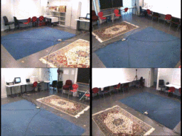

# Multi Camera People Tracking



## Description

Surveillance camera is basically like a normal camera but with high resistance for any condition and placed on the ceiling of the room. Because of that, the basic skill of a surveillance camera like a normal camera is just recording anything inside them, without knowing who they are and what they are doing. The purpose of this project is to give the sequence video, after that detecting people and making it different from each other or labeling each other with some number and connecting each other cameras. Created with YOLOv4-tiny for object detection models and Omni-Scale for person re-identification models.

## Installation

```bash
# Python version 3.7.9 or newer
$ git clone https://github.com/hafidh561/multi-camera-people-tracking.git
$ pip3 install -r requirements.txt
$ python3 download_model.py
```

## Usage

```bash
$ python3 main.py -h
usage: main.py [-h] [-s SOURCE_CONFIG_FILE]

optional arguments:
  -h, --help            show this help message and exit
  -s SOURCE_CONFIG_FILE, --source-config-file SOURCE_CONFIG_FILE
                        Input your config.yaml file
```

```yaml
# Description about config.yaml
video_path: # Video path file to track people -> str
object_detection_model_path: # Object detection models path file, you can download it via 'python3 dowload_model.py' -> str
object_detection_classes_path: # Object detection classes path file, you can download it via 'python3 dowload_model.py' -> str
feature_extraction_model_path: # Feature extraction models path file, you can download it via 'python3 dowload_model.py' -> str
size_each_camera_image: # Size of each camera on multi camera -> arrays
resize_all_camera_image: # Resize windows by scale -> float
object_detection_threshold: # Minimum threshold to detect object -> float
feature_extraction_threshold: # Minimum threshold to extract features -> float
inference_model_device: # Inference device between cpu or cuda -> "str
max_gallery_set_each_person: # Total support set on each person -> int
display_video_camera_tracking: # Display windows output -> boolean
save_video_camera_tracking: # Save tracking to file video -> boolean
fps_save_video_camera_tracking: # FPS for save file video -> float
output_path_name_save_video_camera_tracking: # Directory output to save file video -> str
output_name_save_video_camera_tracking: # File name output -> str
```

## License

[MIT LICENSE](./LICENSE)

© Developed by [hafidh561](https://github.com/hafidh561)
